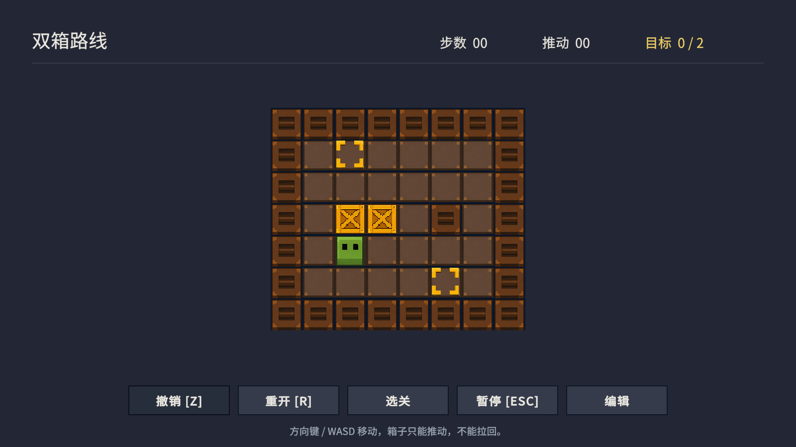
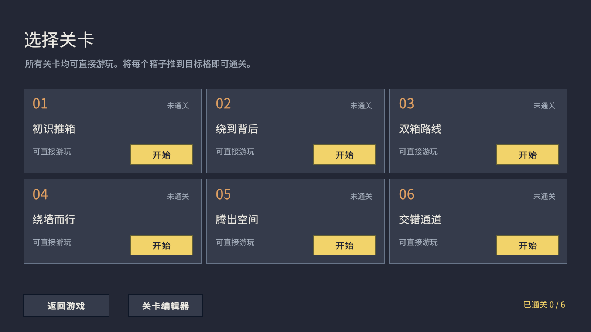
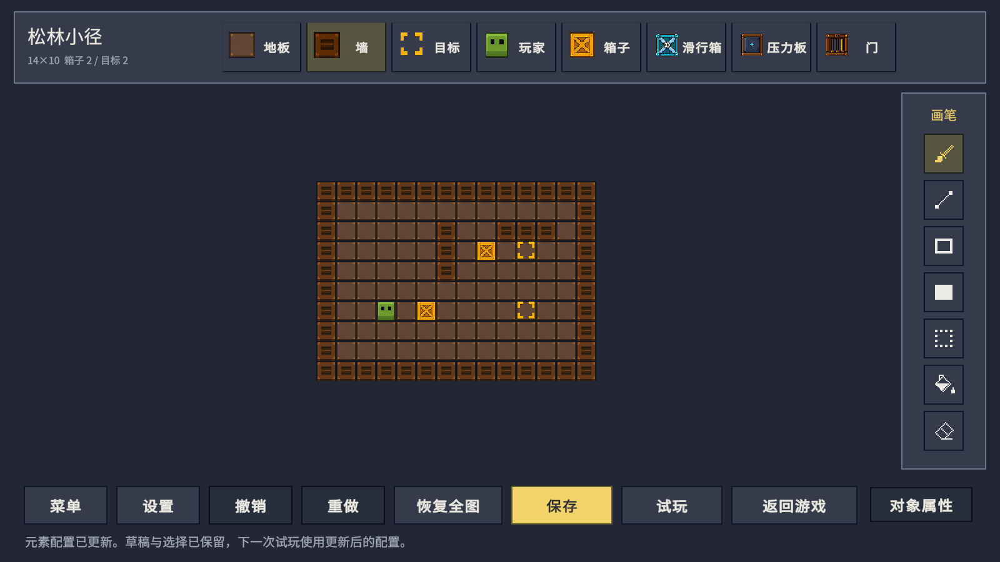
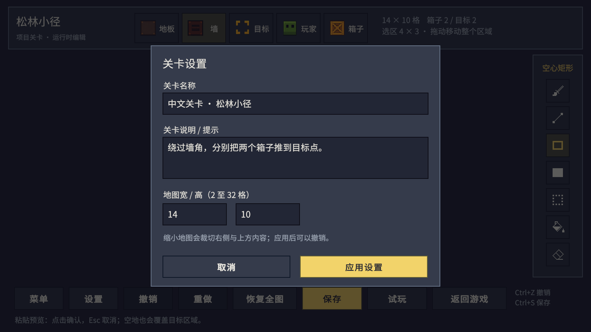
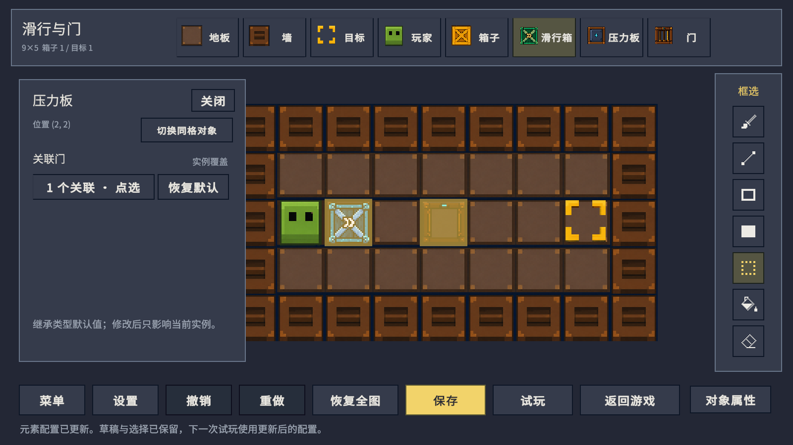
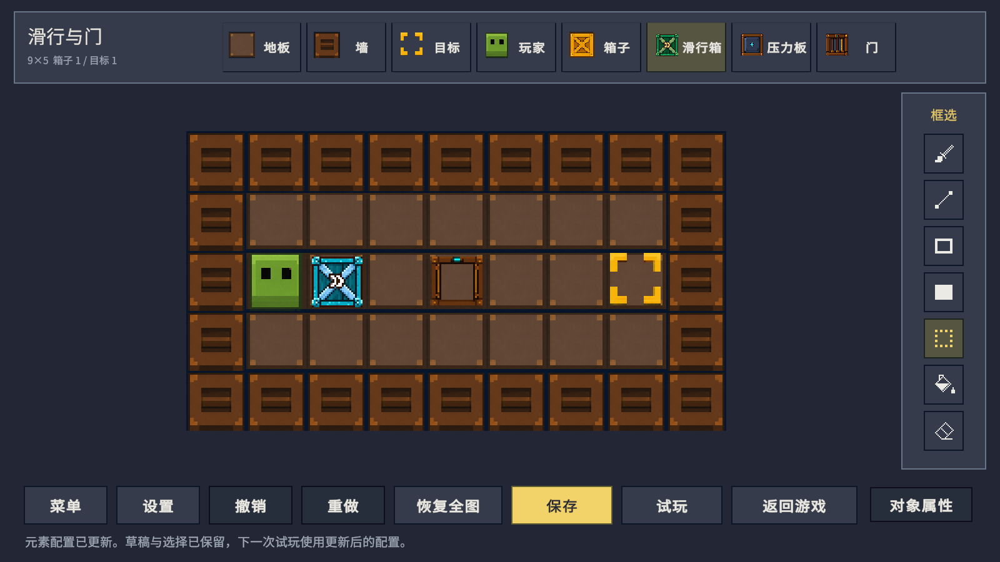

# 推箱子

一个推箱子游戏，内置六个关卡，支持选关、撤销、重开和成绩保存。附带关卡编辑器，可以在 Unity 中一边运行游戏，一边修改地图、试玩和保存关卡。

**Unity 版本：2022.3.51f1**

## 开始游戏

1. 下载或克隆工程，在 Unity Hub 中添加工程根目录。
2. 使用 **Unity 2022.3.51f1** 打开，等待资源导入与脚本编译完成。
3. 打开 [Game.unity](Assets/Scenes/Game.unity)，点击 **Play**。
4. 点击 Game 视图后，使用方向键或 WASD 操作角色。

游戏会进入第一个未通关关卡；全部通关后从第一关开始。

## 游戏玩法

将所有箱子推到目标点即可通关。一次只能推动一个箱子，不能拉回箱子；走错时可以撤销或重开。

| 操作 | 按键或入口 |
|---|---|
| 移动 | WASD / 方向键，支持长按 |
| 撤销一步 | Z / 撤销按钮 |
| 重开当前关卡 | R / 重开按钮 |
| 暂停或继续 | Esc / 暂停菜单 |
| 切换关卡 | 选关按钮 |
| 开关声音 | 暂停菜单 |

顶部显示关卡名称、步数、推动次数和目标完成数量。通关后会保存成绩，也可以进入下一关。

内置关卡：**初识推箱、绕到背后、双箱路线、绕墙而行、腾出空间、交错通道**。选关界面可以直接进入任意关卡，并查看通关状态和最佳记录。

## 编辑关卡

关卡编辑功能在 **Unity 编辑器内**使用，可以修改现有关卡，也可以制作新关卡。

### 打开编辑器

- **运行时编辑：** 进入 Play，在游戏中点击“编辑”，打开当前关卡的初始布局。游玩中已经移动的箱子不会成为新的起点。
- **不运行游戏时编辑：** 使用 Unity 顶部菜单 **推箱子 → 关卡编辑器**，或双击 [关卡资产](Assets/Resources/Levels) 打开原关卡编辑窗口。

下面介绍 Game 视图中的编辑操作。

### 绘制棋盘

顶部元素栏显示当前元素目录中配置的元素，点击图标选择要放置的内容；元素较多时可以横向滚动。右侧选择编辑工具，鼠标悬停可以查看中文说明。

| 工具 | 用法 |
|---|---|
| 画笔 | 按住左键连续绘制 |
| 直线 | 从起点拖到终点，松开后画出一格宽的直线 |
| 空心矩形 | 拖出矩形，只绘制边框 |
| 实心矩形 | 拖出矩形，填满整个区域 |
| 框选 | 拖动玩家或箱子；在空处拖出选区，再拖动选区移动整块内容 |
| 填充 | 填充相邻且内容相同的区域；箱子、目标等不同内容会隔开区域 |
| 橡皮 | 清除格子内容，恢复为空地 |

玩家起点最多一个，只能单点放置或拖动。形状工具在拖动时显示预览，松开鼠标后提交；一笔绘制或一次移动可以整体撤销。

| 编辑操作 | 输入 |
|---|---|
| 强制框选 | 框选工具下 Shift + 左键拖动 |
| 复制 / 粘贴选区 | Ctrl+C / Ctrl+V；粘贴时左键确认 |
| 清空选区 | Delete / Backspace |
| 撤销 / 重做 | Ctrl+Z / Ctrl+Y，也可使用底部按钮 |
| 保存 | Ctrl+S / 保存按钮 |
| 缩放 / 平移 | 滚轮 / 中键拖动 |
| 恢复棋盘全图 | 底部“恢复全图”按钮 |
| 取消当前预览 | Esc |

复制选区会跳过玩家，保留原来的起点。粘贴会覆盖目标区域，包括选区中的空地；越界或覆盖原玩家的粘贴无法提交。

### 设置名称与尺寸

点击底部“设置”，修改中文名称、说明和地图宽高。宽高范围为 **2–32 格**。

缩小地图时会先提示裁切，确认后裁掉右侧和上方超出尺寸的内容；尺寸调整可以撤销。不完整的布局也可以继续编辑。

### 试玩与返回编辑

1. 修改地图后点击底部 **试玩**，无需先保存。
2. 如果存在缺少玩家、箱子与目标数量不匹配等问题，根据中文提示修改后再次试玩。
3. 试玩结束后点击 **返回编辑**，继续修改同一份草稿。工具、视角和撤销历史都会保留。

试玩不记录正式成绩，也不会把试玩中移动后的箱子位置写回地图。

### 保存、新建与加入选关

点击底部 **保存**，将修改写入当前关卡。新建关卡首次保存时会创建关卡资产，停止 Play 后仍然保留。

底部“菜单”中提供：

- **新建关卡：** 创建一份新地图。
- **打开关卡：** 打开工程中已保存的关卡。
- **另存为新关卡：** 将当前布局保存为独立关卡。
- **保存并加入关卡目录：** 保存当前关卡，并让它出现在选关界面。
- **检查关卡：** 检查布局问题，并定位需要修改的格子。

未完成的地图可以保存为草稿；覆盖选关列表中的关卡或加入列表前，需要通过布局检查。

关卡资产位于 [Assets/Resources/Levels](Assets/Resources/Levels)。在 [LevelCatalog.asset](Assets/Resources/Configs/LevelCatalog.asset) 的 **关卡列表** 中，可以调整选关顺序和收录的关卡。

离开有未保存修改的编辑器时，可以选择保存、放弃或取消。**直接停止 Play 不会保留未保存的草稿，请先点击保存。** 保存并返回游戏后，如果当前关卡布局已改变，会从新布局重新开始。

### 修改对象属性与关联

1. 使用“框选”工具单击对象，再点击底部 **对象属性**。
2. 多个对象处于同一格时，可重复单击轮换，或使用属性面板中的 **切换同格对象**。
3. 面板根据元素配置显示可调整的属性。需要关联其他对象时，点击该属性的 **点选**，再在棋盘上选择符合要求的对象；多选关联中再次点击可取消选择。
4. 点击 **完成关联** 提交，或按 Esc 取消。已有对象关联会高亮显示。

**类型默认值**适用于所有没有单独修改该属性的同类对象。属性面板显示 **继承默认** 或 **实例覆盖**；修改属性只影响当前对象，点击 **恢复默认** 会移除这项覆盖，重新使用类型默认值。属性修改与对象关联都支持撤销、重做和保存。

移动对象保留关联；复制选区时，选区内部的关联会指向新复制的对象，选区外的关联保持不变。删除或裁切被关联的对象后会提示断链，需要重新选择，不会自动改绑到其他对象。

## 添加元素与新机制

**新增元素配置**适合制作已有机制的变体，例如更换外观、调整已支持的参数或组合兼容的特性。**开发全新机制**需要先编写并注册规则，再通过元素资产配置使用。

### 新增元素配置

1. 在 Project 窗口的 [元素资产目录](Assets/Resources/Configs/Elements) 中复制一个合适的资产，或右键选择 **Create → 推箱子 → 元素类型**，创建 `ElementDefinition`。
2. 在 Inspector 中设置 **固定类型 ID**、**中文名称**和 **占用层级**，再指定 **元素图标**、**默认素材**及需要的表现预制体。复制资产后必须使用新的唯一类型 ID；关卡通过这个 ID 引用元素，后续改名或更换外观不需要修改 ID。
3. 在 **注册机制 ID** 中填写程序已支持的机制，在 **属性描述** 中填写 `Key`（字段 ID）、`Name`（名称）、`Kind`（类型）和 `Default Value`（默认值），需要调整类型默认参数时填写 **继承默认值**。字段 ID 必须与机制代码读取的参数一致，机制组合也需要通过 Inspector 中的校验。
4. 打开 [ElementCatalog.asset](Assets/Resources/Configs/ElementCatalog.asset)，将新资产拖入 **元素列表**。工程通过 [GameResources.asset](Assets/Resources/GameResources.asset) 的 **元素目录** 引用使用这份配置；若更换了目录，应添加到实际绑定的那一份。
5. 回到关卡编辑器，选择新出现的元素图标，在棋盘上放置对象。通过 **对象属性** 调整实例参数，随后试玩并保存关卡。

**只在文件夹中创建资产不会自动加入元素栏。** 加入目录后，Unity 关卡编辑窗口和 Play 内编辑器都会显示新条目，无需手工添加按钮。

**添加参数字段不会自动产生对应行为。** 参数必须由已实现的规则读取；复制资产也只能得到已有机制的配置变体。类型默认值会被同类对象继承，关卡内的单个对象仍可覆盖或恢复默认。

### 开发全新机制

1. 在 [规则脚本目录](Assets/Scripts/Gameplay/Rules) 中创建继承 [MechanicRule](Assets/Scripts/Gameplay/Rules/MechanicRegistry.cs#L10) 的纯 C# 类，提供稳定的机制 `Id`，并在 `Validate` 中检查适用的元素层级、必需参数和组合限制。
2. 根据行为实现同文件中的 [规则接口](Assets/Scripts/Gameplay/Rules/MechanicRegistry.cs#L20)：推动、推动后的持续移动、通行判断或状态结算。参数通过 `MechanicContext.Value` 或 `ElementRegistry.GetValue` 读取，才能使用类型默认值与实例覆盖；动态状态通过状态接口交给游戏会话处理。
3. 将规则实例加入 [MechanicRegistry.BuiltIns()](Assets/Scripts/Gameplay/Rules/MechanicRegistry.cs#L72)。只有创建类文件还不会接入游戏；完成注册并等待 Unity 编译通过后，在元素资产的 **注册机制 ID** 中填入同一个 `Id`。
4. 按 [PropertyDescriptor](Assets/Scripts/Levels/Model/ElementModel.cs#L44) 声明所需属性，再配置默认值。通过元素资产的 **状态表现规则**，将规则输出的状态字段和值对应到素材、音效；需要预制体时填写 **表现预制体**。然后按上面的步骤把元素加入目录。
5. 在关卡编辑器中放置新元素，检查属性编辑、试玩、撤销、重开，以及保存后重新打开。改变已有机制的行为时，更新该规则的 `Version`，让成绩和验证解识别新的玩法版本。

现有接口支持推箱、持续移动、通行和机关状态结算。传送、多对象连锁移动或新的胜利条件等行为，可能还需要扩展 [GameSession](Assets/Scripts/Gameplay/Rules/GameSession.cs) 及相关校验。专用界面或特殊交互也需要对应的代码和 Prefab。

### UI 会不会同步更新？

**加入当前使用的元素目录后，元素栏和标准属性面板会自动更新。** 自动更新的范围如下：

| 修改 | 当前行为 |
|---|---|
| 只创建元素资产 | 不会自动出现在元素栏，还需要加入目录 |
| 将元素加入当前使用的目录 | 两套编辑器自动生成元素条目，显示名称和图标 |
| 声明受支持的属性 | 自动显示布尔、整数、小数、文本、枚举、单个或多个对象引用的编辑控件 |
| 修改名称、图标或参数 | 编辑器等待当前绘制、拖动、点选或输入结束后刷新 |
| 修改元素使用的机制或有效参数 | 本局规则保持开始时的快照，重新开始或重新试玩后生效 |
| 修改机制代码 | 等待 Unity 重新编译通过，再重新进入 Play 或开始试玩 |
| 增加专用 HUD、特殊属性控件或新工具 | 需要修改代码或 Prefab，不会由元素资产自动生成 |

Scene 中的关卡预览会随相关资产变化刷新。正在游玩的**规则**使用开始时的快照，素材仍通过资产引用读取，并不随规则一起冻结。

有效机制参数或规则版本改变后，旧成绩和验证解不再用于新的玩法；只改名称、说明和素材不会影响成绩。
