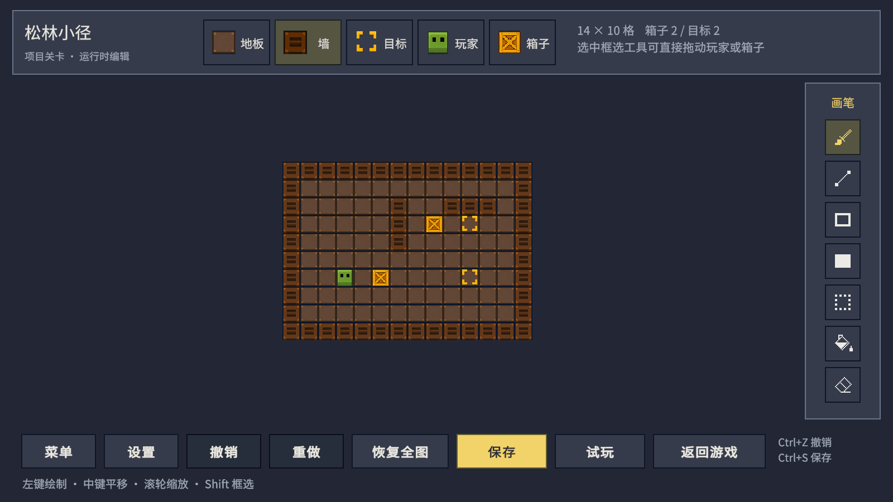
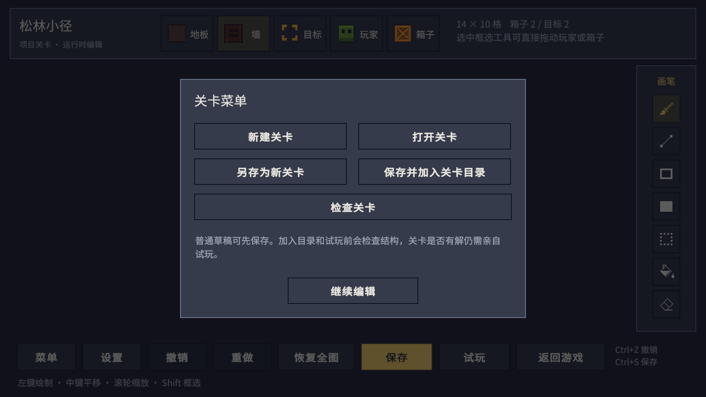

# 数据驱动推箱子

Unity 2022.3.51f1 工程，包含经典推箱子、选关与结算流程，以及在 Game 视图中使用的关卡编辑器。关卡数据、游戏状态和编辑草稿彼此独立。本次在 Unity 工程内验收。

关卡编辑器面向关卡策划等开发人员，仅在 Unity 内使用。可在同一次 Play 中跑测、修改初始布局、试玩并保存到工程资产。普通游戏包（包括 Development Build）不包含专用编辑器代码和编辑入口，不提供玩家创作或本地关卡文件保存。

## 启动与游玩

1. 使用 **Unity 2022.3.51f1** 打开工程，等待资源导入和脚本编译。
2. 打开 `Assets/Scenes/Game.unity`，点击 Play，直接进入尚未通关的关卡。
3. 在游戏底部点击 **编辑** 进入关卡编辑器；点击 **选关** 可选择目录中的任意关卡。

| 游戏操作 | 输入 |
|---|---|
| 移动 | WASD / 方向键，支持长按 |
| 撤销一步 | Z / 撤销按钮 |
| 重开当前关卡 | R / 重开按钮 |
| 暂停、继续 | Esc / 界面按钮 |
| 选关、编辑、下一关、音效 | 界面按钮 |

一次只能推动一个箱子，不能拉箱子。全部箱子到达目标点即通关。成功移动计一步，推动另计一次；撞墙或受阻不计步。撤销恢复位置和计数，重开清空当前游玩历史。

## 角色操控怎么维护

先点击 Game 视图，再用 WASD 或方向键移动。选中场景中的 **GameRoot > Player controls**，即可在 `PlayerController` 中修改方向按键、撤销、重开和暂停快捷键；点击“操作配置”引用调整长按节奏和移动动画时长。保存场景覆盖或对应 Prefab 后，下次运行仍使用这些设置。

| 想修改什么 | 当前入口 |
|---|---|
| 按键、长按重复、输入屏蔽、撤销／重开／暂停快捷键 | [PlayerController.cs](Assets/Scripts/Gameplay/Player/PlayerController.cs) |
| 一次移动如何连接规则、声音、动画和结算 | [GameController.cs](Assets/Scripts/Gameplay/GameController.cs) 的 `Move` |
| 是否能走、是否能推箱、步数与撤销 | [GameSession.cs](Assets/Scripts/Gameplay/Rules/GameSession.cs) 的 `TryMove`、`Undo` |
| 玩家和箱子的移动过渡、受阻反馈 | [BoardView.cs](Assets/Scripts/Gameplay/Board/BoardView.cs) 的 `AnimateRoutine`、`BumpRoutine` |
| 移动动画时长、长按首次间隔、长按重复间隔 | [GameConfig.asset](Assets/Resources/Configs/GameConfig.asset)，直接在 Inspector 调整 |
| 角色素材与显示对象 | [Player.prefab](Assets/Prefabs/Board/Player.prefab) 与 [VisualConfig.asset](Assets/Resources/Configs/VisualConfig.asset) |

例如默认按 D：PlayerController 发出向右移动的意图，GameController 交给 GameSession 检查右边的格子和箱子后方；成功后更新位置，BoardView 把角色和箱子移到对应格子。暂停、输入框获得焦点／输入法组词、窗口失焦或移动动画未完成时，不接受新的方向移动。Player.prefab 负责角色外观，控制入口是 Player controls 节点；角色使用网格规则移动。

脚本现在按游戏功能导航；底层程序集名称保持兼容。目录和职责详情见 [脚本导航说明](docs/script-navigation.md)。

## 不按 Play 也能维护场景

打开 `Assets/Scenes/Game.unity`，展开 **GameRoot** 即可看到应用入口、背景相机、Canvas、EventSystem、音频和棋盘对象。棋盘下面有独立相机、Grid、地形与目标 Tilemap，以及玩家节点。场景中的这些对象也是运行时使用的对象，不会在启动时重新生成一套。

选中 **Board presentation**，在 `BoardView` Inspector 下方选择“预览关卡”。默认显示目录第一关；“定位预览”把 Scene 视角移到棋盘，“刷新预览”重新读取已保存资产，“清除预览”移除临时棋盘。“试玩预览关卡”进入独立试玩，不写正式成绩；普通 Play 仍按进度进入第一个未通关关卡。

预览不修改布局，也不记录玩家移动。关卡、素材或 Prefab 外部更新后自动刷新。保存、关闭场景或进入 Play 前会清理临时对象，回到编辑模式后恢复。预览选择保存在本机当前 Unity 编辑器会话，不写入 Scene。要改格子布局，请使用关卡编辑器。

| 想修改的内容 | 维护位置 |
|---|---|
| 场景接线、相机、Canvas、音频节点 | `Game.unity` 中的 `GameRoot` 实例；共享结构在 `Assets/Prefabs/GameRoot.prefab` |
| 游戏 HUD、选关、暂停、结算、错误页 | `Assets/Prefabs/UI` 中对应页面 Prefab |
| 选关卡片、动态列表条目 | 页面 `UiList` 的 Item Prefab 引用 |
| 棋盘可用显示区域 | 页面中的 **Board viewport** 的 RectTransform；子物体 Pixel surface 由渲染器决定整数像素尺寸 |
| 玩家、箱子表现与图层 | `Assets/Prefabs/Board/Player.prefab`、`Box.prefab` 与 `Board.prefab` |
| 地板、墙、目标、角色和箱子状态图 | `BoardView` 指定的视觉配置（默认 `Assets/Resources/Configs/VisualConfig.asset`）中的精灵引用 |
| 编辑界面、弹窗、工具按钮与提示 | `Assets/Prefabs/Editor/Workshop`；七种工具共享 `Tool button.prefab`，各实例配置图标与中文提示 |
| 移动时长、重复输入节奏、声音 | `GameConfig.asset` 与 `VisualConfig.asset` |
| 关卡布局、名称、说明、目录顺序 | 原关卡编辑窗口或 Unity Play 内的关卡编辑器 |

页面使用真实的 RectTransform、TMP、Image、Button 和布局组件。修改其位置、字体、颜色或尺寸后保存 Prefab 即可生效。`UiButtonVisual` 维护选中与禁用颜色；固定标签直接在 TMP 中修改，关卡名、计数、保存提示等动态内容由流程提供。`UiView` 的 Bindings 是稳定语义键到控件的序列化引用，移动或重命名对象不会断开绑定；删除或替换控件时需补齐对应引用，不要随意修改 Key。

棋盘素材采用方案 B 的暖色仓库风格：**32×32 原图、PPU 32、Point 采样、无压缩与 Mipmap、Full Rect 网格**。地面和木墙使用分层的暖棕色，目标与箱子使用金黄色，角色是橄榄绿色方块和两个深色眼睛。32 像素规格保留木板厚度、倒角、木纹、高光和阴影，不再把造型压缩成图标。六张游戏精灵位于 `Assets/Sprites`，Unity 的导入处理器会持续统一这些设置。棋盘先渲染到低分辨率纹理，再按整数倍显示；剩余空间留边。移动保留时间过渡，显示位置对齐原图像素。中文 UI 独立以窗口分辨率渲染，保持清晰。

“推箱子 > 补齐场景与界面资源”只用于首次准备或补齐缺失资源，已存在的布局 Prefab 不会被重新生成。素材替换以配置引用为准，不会把自定义引用重置回默认图。

## 在 Game 视图中制作关卡

编辑器使用顶部元素栏、右侧工具栏、底部操作栏。进入编辑时读取关卡的初始布局，试玩使用当前草稿的独立副本。

右侧为七个像素图标，顶部显示当前工具名称；选中图标变黄，不可用工具变暗。悬停时底部显示中文操作说明。窄工具栏为中央棋盘留出更多空间。

| 区域 | 操作 |
|---|---|
| 顶部元素 | 地板、墙、目标点、玩家、箱子 |
| 右侧工具 | 画笔、直线、空心矩形、实心矩形、框选 / 拖动、填充、橡皮 |
| 底部操作 | 菜单、设置、撤销、重做、恢复全图、保存、试玩、返回游戏 |
| 菜单 | 新建、打开、另存为、加入关卡目录、检查关卡 |

| 设置 | 名称、说明、2–32 格的宽高；缩小尺寸会先确认，再裁切右侧和上方，支持撤销 |

| 编辑输入 | 行为 |
|---|---|
| 左键拖动 | 绘制、预览形状，或移动选中的内容 |
| 框选工具 / Shift + 左键拖动 | 框选矩形区域；拖动已有选区移动整块内容 |
| 框选工具拖动玩家或箱子 | 单独移动对象，保留两端地板和目标点 |
| Ctrl+C / Ctrl+V | 复制选区 / 预览粘贴，左键确认 |
| Delete / Backspace | 清空选区 |
| Ctrl+Z / Ctrl+Y / Ctrl+Shift+Z | 撤销 / 重做；一次拖动或批量操作是一笔编辑 |
| Ctrl+S | 保存到工程关卡资产 |
| 中键拖动 / 滚轮 | 平移 / 缩放画布 |
| Esc | 取消当前手势或粘贴预览、清除选区，或打开菜单 |

鼠标悬停在棋盘上时显示当前落点预览，右侧显示所选工具的操作说明。画笔拖出地图或经过界面控件时，会取消当前整笔并显示提示；回到画布后需要重新按下鼠标才能继续，避免跨越界面留下意外笔画。

在菜单中检查关卡后，点击带坐标的问题条目，可以定位并用红色高亮对应格子。缩小地图前会明确确认裁切，确认后的尺寸修改可以整次撤销。

目标点可以与箱子或玩家叠加。地板画笔保留对象，墙和橡皮清除该格目标与对象；玩家和箱子不能叠加。玩家起点唯一，只支持单点放置或拖动，不使用直线、矩形和填充批量放置。

直线使用包含两端点的单格线；矩形包含边界。填充按原始布局中相同的**地形、目标点、箱子和玩家组合**进行四方向连通搜索，对角相接不连通。

区域移动和粘贴会替换目标区域的完整内容，空地也会覆盖目标。移动后原区域变为普通空地，重叠区域按操作前快照处理。复制跳过玩家，但保留玩家脚下的地板和目标点；复制目标覆盖现有玩家时拒绝操作。目标区域只要有一格越界，整次移动或粘贴都会被拒绝。

## 保存、试玩与成绩

**保存**直接写入工程内的 `LevelAsset`。新建和另存为使用 `Assets/Resources/Levels` 中的唯一路径，不弹出系统文件对话框。普通保存保留关卡 ID；另存为创建独立 ID。

未加入 `LevelCatalog` 的关卡是**草稿关卡**，允许保存缺少玩家、箱子或目标点的未完成布局。**保存并加入关卡目录**要求通过结构检查，加入后可在游戏选关界面打开。已收录的正式关卡每次保存都必须合法；可以另存为草稿来保留尚未修完的修改。

**试玩**先检查结构，再用当前草稿开始独立游戏，无需先保存。返回编辑后保留草稿、历史和画布视角，试玩不写正式成绩。结构合法不保证谜题有解，仍需实际通关确认。

编辑器内切换、新建或返回游戏时会处理未保存修改。**直接点击 Unity 的 Stop 会丢弃本次 Play 中未保存的草稿、编辑历史和临时游玩状态。** 点击保存已写入磁盘的关卡和目录引用会保留，停止后也能由原编辑窗口打开。

正式成绩保存在 `Application.persistentDataPath/progress.json`，按关卡 ID 和布局版本匹配。保存时若尺寸、地形、目标或对象起点发生变化，布局版本递增，旧布局成绩不再显示为当前成绩；只改名称、说明或目录顺序不升级布局版本。最佳步数和推动次数取自同一次解法，步数相同时优先推数更少的记录。返回原游戏时，如果原关卡布局已保存为新版本，就从新布局重开。

## 原 Unity 编辑窗口

停止 Play 后，使用 **推箱子 > 关卡编辑器**，或双击一个 `LevelAsset` 打开 **关卡工坊**。原窗口保留画笔、尺寸编辑、Undo / Redo、问题格定位、新建与另存、目录移除及排序功能。其编辑规则和保存实现与 Game 视图编辑器共享。

原窗口的 **保存并试玩**会先校验并保存，再进入 Game 场景；退出试玩回到原编辑场景。原编辑场景中的未保存修改不会被替换。运行中保存同一资产后，原窗口的干净草稿会刷新；若窗口仍有未保存编辑，会保留草稿并要求重新加载或另存，阻止静默覆盖。

## 目录与架构

| 路径 | 内容 |
|---|---|
| `Assets/Scripts/Gameplay` | GameController 游戏流程与入口资源引用 |
| `Assets/Scripts/Gameplay/Player` | PlayerController 角色控制与 GameConfig 操作配置类型 |
| `Assets/Scripts/Gameplay/Board` | 棋盘显示、移动动画、像素视口和视觉配置 |
| `Assets/Scripts/Gameplay/Rules` | 推箱规则、游玩状态、撤销与重开 |
| `Assets/Scripts/Levels` | 关卡资产和目录；Model 中保存关卡定义与结构校验 |
| `Assets/Scripts/UI` | 游戏页面、控件、列表与界面基础工具 |
| `Assets/Scripts/Save` | 正式成绩存取 |
| `Assets/Scripts/LevelEditor` | 草稿、编辑工具、编辑视图、试玩合同；Rules 中保存共享编辑算法 |
| `Assets/Scripts/Editor` | LevelEditor：Unity 编辑窗口与保存；Scene：预览；Setup：资源工具；Validation：验收工具 |
| `Assets/Scripts/Tests` | EditMode 与 PlayMode 测试 |
| `Assets/Resources/GameResources.asset` | 游戏入口资源，引用目录、体验配置和视觉配置 |
| `Assets/Resources/Levels` | 关卡资产 |
| `Assets/Resources/Configs` | 目录与配置资产 |
| `Assets/Scenes` | 真实运行场景与编辑期预览入口 |
| `Assets/Prefabs` | 场景组合、棋盘角色、固定界面和列表模板；Editor 子目录只供开发期使用 |
| `Assets/Sprites`、`Assets/Audio`、`Assets/Fonts` | 精灵、音效、字体源和许可证 |

关卡和体验参数使用 ScriptableObject 数据驱动。移动规则由 `GameSession` 执行，编辑规则由 `LevelAuthoring` 执行；Game 视图和 EditorWindow 都编辑深拷贝草稿。`ILevelAssetWriter` 隔开运行时界面与 `UnityEditor`，唯一保存实现由 Editor 层注册。详见 [初始架构决策](docs/adr/0001-data-driven-grid.md)、[共享编辑与资产保存决策](docs/adr/0002-runtime-authoring-and-assets.md) 、[Scene 与像素显示决策](docs/adr/0003-authored-presentation-and-pixels.md) 和 [领域词汇](CONTEXT.md)。

## Unity 内验收

使用 **Window > General > Test Runner** 分别运行 EditMode 与 PlayMode 测试。**推箱子 > 校验关卡目录**检查结构和重复 ID，并回放存在的验证解。关卡编辑会清除过期的验证解，工具不会因为验证解为空而恢复旧布局。

建议先在非 Play 下预览不同关卡，保存、关闭、重开场景，再修改一个 HUD 字体或位置并确认 Play 后保留。之后按下列顺序验收：

1. Play 直接进入关卡，完成移动、推动、撤销、重开、暂停和结算。
2. 进入编辑，绘制直线与矩形，检查目标叠加和填充边界；撤销一次完整手势。
3. 框选并重叠移动，复制后修改原区域再粘贴，检查空地覆盖、玩家保护和越界拒绝。
4. 保存不完整草稿；完成结构后加入目录并试玩；返回编辑核对草稿未被游玩改变。
5. 停止 Play，双击保存的资产核对布局；再运行检查目录引用和新版成绩隔离。
6. 在正常 Domain Reload 与禁用 Domain Reload、保留默认 Scene Reload 两种配置下检查编辑保存与试玩返回。

实际执行结果与限制见 [验证记录](docs/verification.md)。`Tools/prepare_validation.py` 可准备隔离验证副本；运行验证前应等待导入结束，不让两个 Unity 实例同时打开同一工程。

提交时保留 `Assets` 及全部 `.meta`、`Packages`、`ProjectSettings`、`Tools` 与文档。`Library`、`Temp`、`Logs` 和 IDE 生成文件不需要提交。中文字体使用随工程保存的 Noto Sans SC，来源及许可位于 `Assets/Fonts/SOURCE.md`、`Assets/Fonts/OFL.txt`；TMP 的原有许可随导入资源保留。
