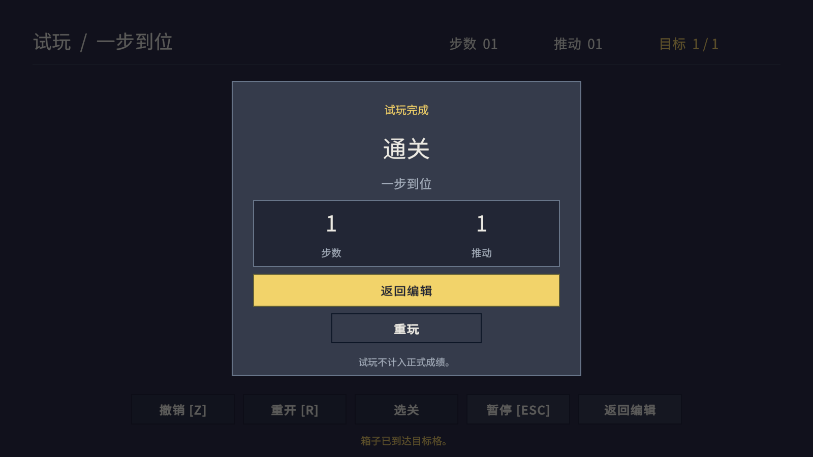

# 推箱子当前验收记录

日期：2026-09-07。当前结果取代下面早期版本的界面与维护方式记录。Unity 2022.3.51f1，Windows；没有打包或分发。

## 恢复交错通道

按用户要求，将 `Assets/Resources/Levels/06-Crossroads.asset` 恢复为 `BuiltInLevels` 中的原始 9×8 布局，包含 3 个箱子和 3 个目标。关卡 ID、资产 GUID 和目录引用保持不变，布局版本从误改后的 1 递增为 2，旧版本成绩不会混用。保存原始验证解后，在隔离 Unity 工程运行全部 ContentTests：15 / 15 通过，包括恢复后的资产执行 29 步解法通关及逐步完整撤销。报告：`Logs/crossroads-restore-content.xml`。其余五个关卡、全部关卡 metadata 和目录资产的哈希与恢复前一致。

## 32×32 方案 B 像素风

六张棋盘精灵最终采用 32×32 原图：暖棕地面、深棕木墙、金黄色目标和箱子、橄榄绿色方块角色。角色保留两个深色方形眼睛；目标是透明叠加图，箱子到位状态同时改变外框和内部颜色。32 像素版本从选定的 B 视觉稿提取造型和明暗关系，保留木板厚度、倒角、木纹、高光与阴影。原精灵路径、`.meta` 与 GUID 保持不变，`VisualConfig` 无须改引用，六个关卡资产的内容哈希也保持不变。

`PixelArtImportSettings` 只处理 `Assets/Sprites` 根目录下这六张棋盘图，统一为 PPU 32、Sprite Single、Full Rect、Point、Clamp、无 Mipmap、无压缩且不生成物理轮廓。棋盘 Prefab 与 BoardView 同步使用每格 32 像素。此前使用数字 8 但未命名的 Layer 已正式命名为 `Board`，生成工具按名称解析该层，棋盘相机只渲染这一层。项目准备工具不再生成正式棋盘美术，只连接已有资源；因此美术替换不会被代码覆盖。

| 本轮检查 | 结果 |
|---|---|
| EditMode：规则、资源引用、32×32 导入和 Board Layer | 112 / 112 通过，无失败或跳过 |
| PlayMode：移动、界面、运行时编辑与像素视口 | 35 / 35 通过，无失败或跳过 |
| 1600×900、1024×768、1920×820 真实 Game 视图 | 每种 13 张；文字溢出 0，运行错误 0 |
| Release / Development 玩家脚本编译 | 两种通过；无 Editor 资源、编辑类型、测试程序集或 UnityEditor 引用 |
| Metadata / GUID 审计 | 152 文件、45 目录、197 metadata；原 84 个文件 GUID 保留，问题 0 |

实际报告位于 `Logs/style-b-32-editmode.xml`、`Logs/style-b-32-playmode.xml`、`Logs/style-b-32-player-script-boundary.txt` 与三个 `Logs/style-b-32-capture*` 目录。已人工查看游玩、编辑与结算截图；当前 README 图片均来自 32×32 版本的真实 Camera / Canvas 渲染。视觉探索原图保存在 `docs/images/style-b-reference.png`，它只用于造型和明暗参考；`docs/images/style-b-32-sprites.png` 是六张正式素材的放大预览。

## GameController 命名调整

游戏总流程类型和文件由 `GameApp` 统一更名为 `GameController`，Prefab、角色控制、运行时编辑器、Editor 工具、测试、反射类型名与文档引用均已同步。脚本 `.meta` 沿用 GUID `f48474d2c2bf43518f1718c0b4d58d7b`，因此 GameRoot Prefab 与 Game Scene 的组件引用保持有效。

重命名后 `gamecontroller-editmode.xml` 为 111 / 111 通过，`gamecontroller-playmode.xml` 为 35 / 35 通过，无失败或跳过。普通与 Development 脚本边界检查通过，正式游戏依赖中没有 Editor 资源或专用编辑类型；本次没有生成游戏包。源代码、测试、工具和当前文档中没有残留旧类型名，资产审计通过。

## 菜单简化补充验收

移除了关卡菜单中“复制选区、粘贴选区、清空选区”的按钮、绑定与生成模板；“检查关卡”占一整行，弹窗高度从 618 调整为 538。用户确认保留快捷键及选区规则，并采用按游戏功能分目录、独立 PlayerController 的调整。

在隔离 Unity 工程中以 1600×900 实际进入 Play，完成 13 张 Camera / Canvas 截图，包括打开及关闭修改后的菜单、编辑、独立试玩、返回编辑与结算。报告为 PASS、文字溢出 0、运行错误 0；已人工查看菜单截图。报告位于 `Logs/menu-simplification/report.txt`，文档截图为 `docs/images/editor-menu.png`。

目录迁移与角色控制拆分后重新运行：`Logs/navigation-editmode.xml` 为 111 / 111 通过；`Logs/navigation-playmode.xml` 为 35 / 35 通过，无跳过。新增六项操控检查覆盖首次／重复长按间隔、动画期间不排队、新按方向优先、Inspector 改键、输入焦点屏蔽、暂停／撤销／重开重置、失焦及编辑往返。真实 GameRoot Prefab 包含角色控制对象和配置引用。首次启动验证副本时旧缓存列出已迁移路径，自动重导入后完成编译；随后的 PlayMode 运行没有编译错误。

继续完成 `navigation-authoring-results.txt` 与 `navigation-bridge-results.txt` 中的普通／禁用 Domain Reload 两轮检查，保存、试玩、返回和停止后的持久化均通过。`navigation-player-boundary.txt` 中 Release 与 Development 脚本编译及依赖检查通过，没有生成游戏包。资源审计无问题；与迁移前快照逐项比较，原 184 个文件／文件夹 GUID 全部保留，六个关卡资产的内容哈希完全不变。

## Scene 改造回归记录

| 本轮检查 | 结果 |
|---|---|
| EditMode：规则、内容、资产、成绩、字体、Prefab 引用、预览保存隔离 | 111 / 111 通过，无跳过 |
| PlayMode：真实 GameRoot Prefab、编辑工具、界面状态、像素尺寸与拾取 | 29 / 29 通过 |
| 非 Play 预览 | 创建、清理、保存、重开场景通过；场景不变脏，关卡 JSON 不变，无临时对象写入 |
| 资产保存：普通 / 禁用 Domain Reload | 两轮通过；退出 Play 后重新导入关卡与目录，原编辑窗口可打开 |
| 原编辑器试玩桥：普通 / 禁用 Domain Reload | 两轮通过；实际移动通关，恢复原场景与试玩启动设置 |
| Release / Development 脚本编译 | 两种通过；无专用编辑类型、入口、测试程序集或 UnityEditor 依赖 |
| Game Scene 与 GameRoot 的递归依赖 | 无 Editor 目录的 Prefab、脚本或图标引用 |
| Metadata / GUID 审计 | 147 文件、37 目录、184 metadata；原 84 个文件 GUID 保留 |

维护性回归实际修改 HUD 的 RectTransform、字号与颜色，再切换选关和游玩，确认同一个视图实例保留这些属性。棋盘的 RawImage 尺寸等于低分辨率纹理乘整数倍率，画面边界与角色位置对齐像素，拾取使用同一显示区域。七个工具按钮是共享模板的实例，图标与中文提示通过真实序列化组件检查。

三种 Game 视图（1600×900、1024×768、1920×820）各完成 12 张真实 Camera / Canvas 截图。三组均为文字溢出 0、运行错误 0，并检查工具图标可见。已查看游戏、编辑器、中文设置及结算画面；该轮使用的 8×8 素材属于历史结果，当前以文档顶部的 32×32 方案 B 为准。截图在 `Logs/Captures-presentation/<尺寸>`。

## 历史记录：第六关误改

此前 Scene / 美术改造没有写入六个关卡资产。第六关曾于 2026-09-06 21:44 保存为布局版本 1：墙体切断上下区域，玩家在上方，而下方仍有箱子与目标；右上角 `(7,6)` 的箱子也无法从右侧或上侧推动。该误改版本没有验证解缓存。

当时按“不重置关卡内容”的要求保留这一版本。2026-09-07 用户明确要求恢复后，现已恢复为原始布局并保存为版本 2，通关与撤销检查通过，详见本页“恢复交错通道”。

## 环境与复现

回归在 `.utmp/ValidationProject` 完成，使用独立 Library。资产写入与正式成绩使用临时隔离目录。`RuntimeAuthoringSmoke` 与 `EditorBridgeSmoke` 现使用 `-force-d3d11`，不传 `-nographics`：Unity 2022.3 在无图形设备模式渲染 Tilemap 到纹理时曾发生原生崩溃；真实图形设备运行已通过。

新增场景保护检查：在 Game Scene 内创建未保存对象，执行备份后载入，验证独立 Recovery 资产包含该对象，而新版 Scene 保持干净且引用完整。该检查只在隔离工程执行。

原 Unity 窗口目前仍停在“场景已被外部修改”提示框。通过本地验证桥已请求资源刷新，但场景确认阻挡了后续脚本重载；原窗口的当前编译清单尚不是最终版本。直接 Reload 被自动审批阻止，以免丢弃未保存修改；已实现并测试先保存副本再重载的安全流程，原窗口的最终应用尚待确认及窗口恢复。本轮不能把隔离工程编译通过等同于原窗口已完成重载。

原始结果：`Logs/presentation-editmode.xml`、`Logs/presentation-playmode.xml`、`Logs/presentation-authoring-results.txt`、`Logs/presentation-bridge-results.txt`、`Logs/presentation-player-script-boundary.txt`、`Logs/asset-audit.txt`。

物理鼠标与 Windows 中文输入法候选窗未完成原生窗口人工验收；输入焦点、中文显示、补字和 UI 射线保护有自动化覆盖。两种 Domain Reload 都保留默认 Scene Reload；没有验证禁用 Scene Reload 或独立游戏包。

---

## 早期版本记录

# 推箱子改造验证记录

## 2026-09-06：图标工具栏与开发编辑器隔离

右侧工具栏从 290 缩至 132 个布局单位，棋盘视口宽度从 1220 增至 1380。七种工具采用自绘像素图标，保留当前工具中文名称、悬停说明、选中高亮及玩家元素下的批量工具禁用状态。图标不依赖字体或额外的打包资源。

编辑器专用组件、保存合同及试玩请求通过 `UNITY_EDITOR` 排除，GameController 的编辑与试玩入口同步排除；独立游戏底部四项操作重新居中。PlayMode 测试使用 `UNITY_EDITOR` 编译约束，同时保持 PlayMode 分类。

- EditMode：106 / 106 通过；PlayMode：28 / 28 通过，新增图标点击、悬停说明、工具栏射线拦截及禁用按钮检查。
- 运行时保存与原窗口试玩桥在正常、禁用 Domain Reload 两种设置下均通过。停止 Play 后重新导入关卡、目录并由原窗口打开，数据仍然保留。
- `PlayerScriptBoundaryCheck.Run` 使用 Unity 的脚本编译接口分别编译 Release 与 Development 配置，检查产物中不存在专用编辑类型、编辑入口、测试程序集和 UnityEditor 引用。两种配置均通过；仅生成脚本程序集，没有构建场景、资源或可执行游戏包。
- 原工程自己的 Runtime / Editor 编译响应文件也完成编译检查，产物写入 Logs，没有替换正在使用的 Library 程序集。
- 资产审计通过：102 个文件、27 个目录、129 个 metadata，迁移前 84 个资产 GUID 保留。

1600×900、1024×768、1920×820 三种 Game 视图各完成 12 张实际 Camera / Canvas 渲染截图，文字溢出及运行时错误均为 0。已检查图标形状、中文悬停提示、当前工具名称和玩家元素下的灰色禁用状态。验收会逐个读取未被弹窗遮挡的可用图标区域，检查图标像素确实可见，避免空白按钮被当作通过。截图位于 `Logs/Captures-icons/<尺寸>`，文档截图已同步更新。

本轮结果位于 `Logs/icons-editmode.xml`、`Logs/icons-playmode.xml`、`Logs/icons-authoring-results.txt`、`Logs/icons-bridge-results.txt` 和 `Logs/icons-player-script-boundary.txt`。以下 2026-09-05 记录保留为此前完整改造的基线。

日期：2026-09-05。Unity 2022.3.51f1，Windows，编辑器内运行。

本次只验证 Unity 工程与 Game 视图，没有构建或分发游戏包。原工程保持打开，测试在 `.utmp/ValidationProject` 隔离副本中完成，拥有独立的 Library；资产写入测试使用临时目录，试玩验证隔离正式成绩。

## 自动化结果

| 检查 | 结果 |
|---|---|
| EditMode：规则、六关解法、撤销、编辑算法、资产保存、旧窗口冲突、成绩与字体 | 106 / 106 通过 |
| PlayMode：真实游戏流程、编辑事务、试玩返回、射线拦截、裁切确认、问题定位 | 27 / 27 通过 |
| 原编辑器试玩桥：正常 / 禁用 Domain Reload | 两轮通过 |
| 运行时资产保存：正常 / 禁用 Domain Reload | 两轮通过 |
| 资源迁移与程序集边界审计 | 通过 |

六个教学关卡均对实际保存布局回放已知解，并验证撤销恢复。第一关的验证解缓存原本为空，保留该状态；测试使用独立的已知解，不向资产回填或重置布局。

共享编辑算法覆盖：包含端点的直线、退化矩形、连续笔画、四方向完整格内容填充、玩家批量限制、区域快照、空地覆盖、重叠移动、复制玩家保护、越界整次拒绝、对象与目标叠加、调整尺寸及一次撤销恢复。

PlayMode 测试覆盖：直接进关和通关后循环、成绩版本匹配、运动动画与撤销、暂停、试玩不计成绩、初始布局编辑、返回原会话或从已保存的新布局重开、裁切的确认与取消、问题格定位、UI 射线拦截及非法粘贴的红色预览。

## 保存到工程

`RuntimeAuthoringSmoke` 在正常 Domain Reload 和 Disable Domain Reload 下各执行一轮；两轮都保留默认 Scene Reload。

实际流程为：原入口进入试玩 → 打开运行时编辑器 → 保存独立关卡并加入临时目录 → 改布局再次保存并检查版本递增 → 在同次 Play 内试玩并返回草稿 → 返回原会话 → 退出 Play → 强制重新导入磁盘关卡与目录 → 使用原 `LevelEditorWindow` 打开保存结果。

两轮均验证 `.asset` 内容及目录引用在停止 Play 后保留，原始关卡、生产目录和正式成绩未改变。原窗口的干净刷新、脏草稿冲突、另存、新建、正式关卡拒绝非法覆盖和只读写入失败由 EditMode 的真实资产测试覆盖。

`EditorBridgeSmoke` 另行验证旧入口在两种 Domain Reload 设置下实际移动通关、退出试玩并恢复原场景及 `playModeStartScene`。

## 中文与画面

Noto Sans SC 静态字库生成了 **521 个字符**，缺字数为 0；用户输入使用保留源字体的动态多图集 fallback。测试用静态字库之外的罕见汉字 U+9F98 在临时字体中实际补字成功，没有修改持久字体资产。输入框及项目文本关闭富文本解析，输入焦点和 IME composition 会阻止游戏与编辑快捷键。

| Game 视图尺寸 | 界面截图 | UI 文字溢出 / 越界按钮 | 运行时错误 |
|---|---:|---:|---:|
| 1600 × 900 | 10 张，通过 | 0 | 0 |
| 1024 × 768 | 10 张，通过 | 0 | 0 |
| 1920 × 820 | 10 张，通过 | 0 | 0 |

每种尺寸在 Unity Editor 中进入 Play，截取游戏、暂停、编辑器、形状预览、粘贴预览、设置、试玩、返回编辑、选关和结算。画面直接由实际 Background camera、Board camera 与 Canvas 渲染到纹理，没有制作外部界面模型。背景像素核对为 `#232735`。截图同时验证试玩返回后的草稿、撤销重做历史、工具、缩放和平移状态，以及独立试玩结算不写正式成绩。

已人工查看三种比例的游戏、编辑器和中文设置界面，以及选关、暂停、形状/粘贴预览与结算。首轮截图发现的中文行高裁剪和重复返回按钮已修正，以上是修正后的结果。




## 验证限制

原生窗口自动化返回的截图未正确对应 Unity，重新聚焦窗口又超时，因此没有把它用于坐标点击。鼠标逻辑、射线、焦点与界面操作通过 Unity 内测试和实际渲染验证；**Windows 中文输入法的候选窗、组词、提交全过程，以及物理鼠标逐工具操作，尚未完成原生窗口人工验收。** 中文文字显示、富文本关闭、动态补字与焦点保护已通过自动化检查。

结构校验不证明关卡有解；新创作内容仍需通过试玩确认可解。此次未验证 Disable Scene Reload，亦未进行打包和独立播放器验收。

## 资源与复现

资源审计检查 100 个文件、27 个目录、127 个 `.meta`：没有缺失/孤立 metadata 或重复 GUID。迁移前 84 个实体资产的 GUID 全部保留，移除的空目录 metadata 单独排除。Runtime/Core 无 `UnityEditor` 引用，项目 C# 不再依赖旧资源目录。持久化迁移基准在 `Tools/asset-guid-baseline.txt`。

### 已打开工程的脚本导入回归

原工程曾在 `GameViewCaptureSmoke.cs` 报三处 `CS0103`：其已有 Library 的 Runtime 编译清单漏掉了 `DevelopmentCapture.cs`，尽管文件存在、`UNITY_EDITOR` 宏及程序集引用均正确。保留脚本 GUID，将辅助组件移至 `Assets/Scripts/Runtime/Diagnostics/DevelopmentCapture.cs` 后，原 Unity 重新导入并更新了两个程序集。使用原工程自己的 `Sokoban.Editor.rsp` 调用 Unity Roslyn 编译器，修复前稳定复现三处错误，修复后退出码为 0。后续此类验证需同时核对原工程的导入清单，不能只依赖干净副本。

本地原始结果：

- `Logs/v2-editmode-final.xml`、`Logs/v2-playmode-final.xml`
- `Logs/v2-bridge-results.txt`、`Logs/v2-authoring-results.txt`
- `Logs/chinese-font-report.txt`、`Logs/asset-audit.txt`
- `Logs/Captures-v2/<宽>x<高>/report.txt` 与 10 张 PNG

可在 Unity 的 Test Runner 分别运行 EditMode、PlayMode。资产审计为 `python Tools/audit_assets.py`。准备隔离副本为 `python Tools/prepare_validation.py`；不要让两个 Unity 实例打开同一个工程路径。

以下入口都自行等待异步 Play 流程再退出，**不要添加 `-quit`**：

```powershell
& 'C:\Unity\2022.3.51f1\Editor\Unity.exe' -batchmode -nographics -projectPath '<隔离工程>' -executeMethod Sokoban.EditorTools.EditorBridgeSmoke.Begin -logFile '<日志>'
& 'C:\Unity\2022.3.51f1\Editor\Unity.exe' -batchmode -nographics -projectPath '<隔离工程>' -executeMethod Sokoban.EditorTools.RuntimeAuthoringSmoke.Begin -logFile '<日志>'
```

界面截图需要真实图形设备，不添加 `-nographics`：

```powershell
& 'C:\Unity\2022.3.51f1\Editor\Unity.exe' -batchmode -force-d3d11 -projectPath '<隔离工程>' -executeMethod Sokoban.EditorTools.GameViewCaptureSmoke.Run -sokoban-capture '<截图目录>' -sokoban-size 1600x900 -logFile '<日志>'
```

字体生成入口为 `Sokoban.EditorTools.ChineseFontSetup.Generate`，也可从“推箱子 > 更新中文字体”执行。固定中文文案变更后需重新生成；来源与许可证在 `Assets/Fonts`。
